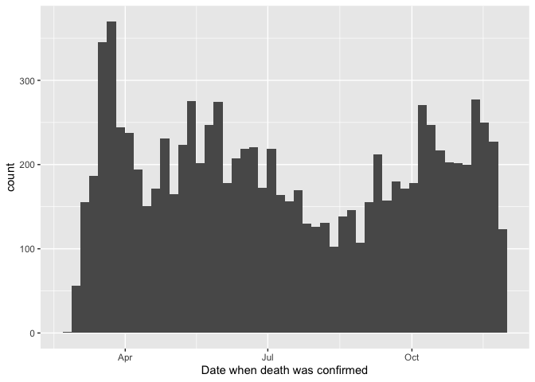
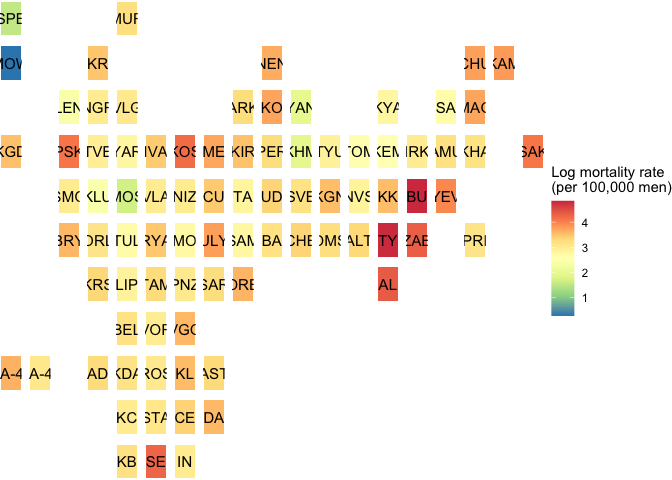
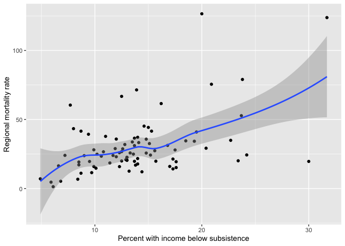
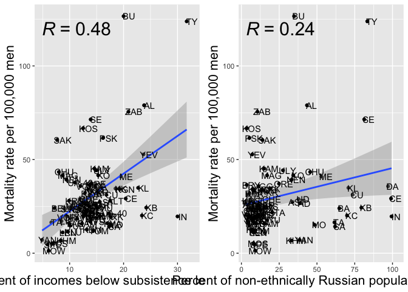

Russian military losses in Ukraine
================
December 2022

#### The replication analysis for A.Bessudnov. (2022). “Ethnic and regional inequalities in the Russian military fatalities in the 2022 war in Ukraine”. SocArXiv. <https://osf.io/preprints/socarxiv/s43yf> . DOI 10.31235/osf.io/s43yf .

``` r
library(tidyverse)
library(geofacet)
library(DescTools)
library(Hmisc)
library(ggpubr)
library(lubridate)

options(tibble.width = Inf)

df <- read_csv("dfCasualties.csv")
```

## Fatalities over time

``` r
df |>
  filter(deathConfirmedDate < dmy("2.12.2022")) |>
  ggplot(aes(x = deathConfirmedDate)) +
  geom_histogram(bins = 50) +
  xlab("Date when death was confirmed")
```

<!-- -->

## Number of men killed and mortality rate per capita by region

``` r
# Read the 2021 census data.

census2021 <- read_csv("census2021_nMen16-615.csv")

# This file has a variable nMen16_615_2021: the number of men in the working age (16-61.5) by region
# as per census 2021 (2020).

# Number of men killed by region and mortality rate per 100,000 men aged 16-61.5

table_mortRates <- df |>
  filter(!is.na(region)) |>
  count(region) |>
  # join with the census data
  left_join(census2021, by = c("region" = "regNameEng")) |>
  # calculate mortality rate per 100,000 men, with confidence intervals
  mutate(mortalityRate = map2(n, nMen16_615_2021, ~ prop.test(.x, .y, conf.level=0.95) |>
                                     broom::tidy())) |>
  unnest(mortalityRate) |>
  mutate(mortalityRate = estimate * 100000) |>
  mutate(mortalityRate_lowCI = conf.low * 100000) |>
  mutate(mortalityRate_highCI = conf.high * 100000) |>
  arrange(-mortalityRate) |>
  select(region, regNameISO, n, nMen16_615_2021, mortalityRate, mortalityRate_lowCI, mortalityRate_highCI) 

table_mortRates |>
  print(n = Inf)
```

    ## # A tibble: 85 × 7
    ##    region              regNameISO     n nMen16_615_2021 mortalityRate
    ##    <chr>               <chr>      <int>           <dbl>         <dbl>
    ##  1 Buryatia            BU           353          278885        127.  
    ##  2 Tuva                TY           115           92884        124.  
    ##  3 Altai Republic      AL            46           58226         79.0 
    ##  4 Zabaykalsky         ZAB          225          297873         75.5 
    ##  5 North Ossetia       SE           148          207166         71.4 
    ##  6 Kostroma            KOS          108          161784         66.8 
    ##  7 Pskov               PSK          107          173864         61.5 
    ##  8 Sakhalin            SAK           89          147268         60.4 
    ##  9 Yevreyskaya         YEV           24           45466         52.8 
    ## 10 Kamchatka           KAM           43           95111         45.2 
    ## 11 Ulyanovsk           ULY          154          347851         44.3 
    ## 12 Chukotka            CHU            7           16138         43.4 
    ## 13 Komi                KO            92          221218         41.6 
    ## 14 Magadan             MAG           19           45707         41.6 
    ## 15 Mari El             ME            81          197794         41.0 
    ## 16 Nenets              NEN            5           12717         39.3 
    ## 17 Sevastopol          UA-40         68          179931         37.8 
    ## 18 Orenburg            ORE          200          538936         37.1 
    ## 19 Bryansk             BRY          126          345546         36.5 
    ## 20 Volgograd           VGG          282          787188         35.8 
    ## 21 Dagestan            DA           354          990582         35.7 
    ## 22 Kalmykia            KL            28           80177         34.9 
    ## 23 Khakassia           KK            52          150548         34.5 
    ## 24 Kurgan              KGN           73          213102         34.3 
    ## 25 Kaliningrad         KGD          108          320095         33.7 
    ## 26 Kirov               KIR          107          321441         33.3 
    ## 27 Karelia             KR            49          150418         32.6 
    ## 28 Ryazan              RYA          102          319814         31.9 
    ## 29 Chuvashia           CU           107          342404         31.2 
    ## 30 Ivanovo             IVA           83          266919         31.1 
    ## 31 Chechnya            CE           135          462280         29.2 
    ## 32 Udmurtia            UD           121          418157         28.9 
    ## 33 Chelyabinsk         CHE          290         1008253         28.8 
    ## 34 Kursk               KRS           87          310158         28.1 
    ## 35 Altai Krai          ALT          166          593766         28.0 
    ## 36 Astrakhan           AST           79          288596         27.4 
    ## 37 Adygea              AD            39          145977         26.7 
    ## 38 Tambov              TAM           77          289077         26.6 
    ## 39 Arkhangelsk         ARK           74          284986         26.0 
    ## 40 Perm                PER          189          733107         25.8 
    ## 41 Saratov             SAR          190          739119         25.7 
    ## 42 Omsk                OMS          136          545368         24.9 
    ## 43 Murmansk            MUR           53          213224         24.9 
    ## 44 Kabardino-Balkaria  KB            67          275463         24.3 
    ## 45 Amur                AMU           58          239274         24.2 
    ## 46 Belgorod            BEL          109          453917         24.0 
    ## 47 Bashkortostan       BA           297         1239319         24.0 
    ## 48 Sverdlovsk          SVE          306         1284804         23.8 
    ## 49 Krasnodar           KDA          419         1788305         23.4 
    ## 50 Khabarovsk          KHA           93          403638         23.0 
    ## 51 Oryol               ORL           47          207507         22.6 
    ## 52 Primorsky           PRI          130          576846         22.5 
    ## 53 Stavropol           STA          194          892044         21.7 
    ## 54 Crimea              UA-43        119          557147         21.4 
    ## 55 Vologda             VLG           69          330328         20.9 
    ## 56 Penza               PNZ           75          365483         20.5 
    ## 57 Rostov              ROS          261         1274849         20.5 
    ## 58 Karachay-Cherkessia KC            28          139233         20.1 
    ## 59 Vladimir            VLA           79          395638         20.0 
    ## 60 Smolensk            SMO           52          262742         19.8 
    ## 61 Novgorod            NGR           32          162326         19.7 
    ## 62 Ingushetia          IN            34          173094         19.6 
    ## 63 Nizhny Novgorod     NIZ          179          912761         19.6 
    ## 64 Irkutsk             IRK          133          684291         19.4 
    ## 65 Voronezh            VOR          133          692268         19.2 
    ## 66 Tver                TVE           67          361629         18.5 
    ## 67 Tyumen              TYU           81          454731         17.8 
    ## 68 Lipetsk             LIP           57          332336         17.2 
    ## 69 Novosibirsk         NVS          139          821000         16.9 
    ## 70 Tatarstan           TA           196         1191152         16.5 
    ## 71 Krasnoyarsk         KYA          139          867922         16.0 
    ## 72 Yaroslavl           YAR           55          344538         16.0 
    ## 73 Samara              SAM          149          938500         15.9 
    ## 74 Mordovia            MO            36          237055         15.2 
    ## 75 Tula                TUL           65          441544         14.7 
    ## 76 Sakha               SA            44          309283         14.2 
    ## 77 Kemerovo            KEM           95          754643         12.6 
    ## 78 Tomsk               TOM           39          321782         12.1 
    ## 79 Kaluga              KLU           38          330134         11.5 
    ## 80 Leningrad           LEN           71          639765         11.1 
    ## 81 Yamalo-Nenets       YAN           12          169683          7.07
    ## 82 Khanty-Mansi        KHM           37          548522          6.75
    ## 83 Moscow Oblast       MOS          149         2812520          5.30
    ## 84 St.Petersburg       SPE           79         1711227          4.62
    ## 85 Moscow              MOW           54         4096435          1.32
    ##    mortalityRate_lowCI mortalityRate_highCI
    ##                  <dbl>                <dbl>
    ##  1              114.                 141.  
    ##  2              103.                 149.  
    ##  3               58.5                106.  
    ##  4               66.1                 86.2 
    ##  5               60.6                 84.2 
    ##  6               55.0                 80.9 
    ##  7               50.7                 74.7 
    ##  8               48.8                 74.7 
    ##  9               34.6                 79.9 
    ## 10               33.1                 61.5 
    ## 11               37.7                 52.0 
    ## 12               19.0                 93.7 
    ## 13               33.7                 51.2 
    ## 14               25.8                 66.3 
    ## 15               32.7                 51.2 
    ## 16               14.5                 97.5 
    ## 17               29.6                 48.2 
    ## 18               32.2                 42.7 
    ## 19               30.5                 43.6 
    ## 20               31.8                 40.3 
    ## 21               32.2                 39.7 
    ## 22               23.7                 51.2 
    ## 23               26.1                 45.7 
    ## 24               27.0                 43.3 
    ## 25               27.8                 40.9 
    ## 26               27.4                 40.4 
    ## 27               24.4                 43.4 
    ## 28               26.1                 38.9 
    ## 29               25.7                 37.9 
    ## 30               24.9                 38.7 
    ## 31               24.6                 34.7 
    ## 32               24.1                 34.7 
    ## 33               25.6                 32.3 
    ## 34               22.6                 34.8 
    ## 35               23.9                 32.6 
    ## 36               21.8                 34.3 
    ## 37               19.3                 36.9 
    ## 38               21.2                 33.5 
    ## 39               20.5                 32.8 
    ## 40               22.3                 29.8 
    ## 41               22.2                 29.7 
    ## 42               21.0                 29.6 
    ## 43               18.8                 32.8 
    ## 44               19.0                 31.1 
    ## 45               18.6                 31.6 
    ## 46               19.8                 29.1 
    ## 47               21.4                 26.9 
    ## 48               21.3                 26.7 
    ## 49               21.3                 25.8 
    ## 50               18.7                 28.4 
    ## 51               16.8                 30.4 
    ## 52               18.9                 26.9 
    ## 53               18.8                 25.1 
    ## 54               17.8                 25.7 
    ## 55               16.4                 26.6 
    ## 56               16.3                 25.9 
    ## 57               18.1                 23.2 
    ## 58               13.6                 29.5 
    ## 59               15.9                 25.0 
    ## 60               14.9                 26.2 
    ## 61               13.7                 28.2 
    ## 62               13.8                 27.8 
    ## 63               16.9                 22.8 
    ## 64               16.3                 23.1 
    ## 65               16.1                 22.8 
    ## 66               14.5                 23.7 
    ## 67               14.2                 22.3 
    ## 68               13.1                 22.4 
    ## 69               14.3                 20.1 
    ## 70               14.3                 19.0 
    ## 71               13.5                 19.0 
    ## 72               12.1                 20.9 
    ## 73               13.5                 18.7 
    ## 74               10.8                 21.3 
    ## 75               11.5                 18.9 
    ## 76               10.5                 19.3 
    ## 77               10.2                 15.5 
    ## 78                8.74                16.7 
    ## 79                8.26                16.0 
    ## 80                8.73                14.1 
    ## 81                3.83                12.7 
    ## 82                4.82                 9.40
    ## 83                4.50                 6.24
    ## 84                3.68                 5.79
    ## 85                1.00                 1.73

## Map of mortality rates by region

``` r
# This sets a grid for a map.

ru_federal_subjects_2022 <- data.frame(
  row = c(1, 1, 2, 2, 2, 2, 2, 3, 3, 3, 3, 3, 3, 3, 3, 3, 4, 4, 4, 4, 4, 4, 4, 
          4, 4, 4, 4, 4, 4, 4, 4, 4, 4, 5, 5, 5, 5, 5, 5, 5, 5, 5, 5, 5, 5, 5, 
          5, 6, 6, 6, 6, 6, 6, 6, 6, 6, 6, 6, 6, 6, 6, 7, 7, 7, 7, 7, 7, 7, 8, 
          8, 8, 9, 9, 9, 9, 9, 9, 9, 10, 10, 10, 10, 11, 11, 11),
  col = c(1, 5, 17, 18, 4, 10, 1, 11, 16, 17, 3, 4, 5, 9, 10, 14, 11, 12, 8, 9,  
          10, 16, 17, 19, 1, 3, 13, 14, 15, 4, 5, 6, 7, 11, 12, 7, 8, 9, 10, 16,
          13, 14, 15, 3, 4, 5, 6, 11, 7, 8, 9, 10, 17, 12, 13, 14, 15, 3, 4, 5, 
          6, 7, 8, 9, 14, 4, 5, 6, 5, 6, 7, 2, 4, 5, 6, 7, 8, 1, 5, 6, 7, 8, 5, 6, 7),
  code = c("SPE", "MUR", "CHU", "KAM", "KR", "NEN", "MOW", "YAN", "SA", 
           "MAG", "LEN", "NGR", "VLG", "ARK", "KO", "KYA", "KHM", "TYU", 
           "ME", "KIR", "PER", "AMU", "KHA", "SAK", "KGD", "PSK", "TOM", 
           "KEM", "IRK", "TVE", "YAR", "IVA", "KOS", "SVE", "KGN", "NIZ", 
           "CU", "TA", "UD", "YEV", "NVS", "KK", "BU", "SMO", "KLU", 
           "MOS", "VLA", "CHE", "MO", "ULY", "SAM", "BA", "PRI", "OMS", 
           "ALT", "TY", "ZAB", "BRY", "ORL", "TUL", "RYA", "PNZ", "SAR", 
           "ORE", "AL", "KRS", "LIP", "TAM", "BEL", "VOR", "VGG", "UA-43", 
           "AD", "KDA", "ROS", "KL", "AST",  "UA-40" ,"KC", "STA", "CE", "DA", 
           "KB", "SE", "IN"),
  name = c("St.Petersburg", "Murmansk", "Chukotka", 
           "Kamchatka", "Karelia", "Nenets", 
           "Moscow", "Yamalo-Nenets", "Sakha", 
           "Magadan", "Leningrad", "Novgorod", 
           "Vologda", "Arkhangelsk", "Komi", 
           "Krasnoyarsk", "Khanty-Mansi", 
           "Tyumen", "Mari El", "Kirov", 
           "Perm", "Amur", "Khabarovsk", 
           "Sakhalin", "Kaliningrad", "Pskov", 
           "Tomsk", "Kemerovo", "Irkutsk", 
           "Tver", "Yaroslavl", "Ivanovo", 
           "Kostroma", "Sverdlovsk", "Kurgan", 
           "Nizhny Novgorod", "Chuvashia", "Tatarstan", 
           "Udmurtia", "Yevreyskaya", 
           "Novosibirsk", "Khakassia", "Buryatia", 
           "Smolensk", "Kaluga", "Moscow Oblast", 
           "Vladimir", "Chelyabinsk", "Mordovia", 
           "Ulyanovsk", "Samara", "Bashkortostan", 
           "Primorsky", "Omsk", "Altai Krai", "Tuva", 
           "Zabaykalsky", "Bryansk", "Oryol", 
           "Tula", "Ryazan", "Penza", 
           "Saratov", "Orenburg", "Altai Republic", 
           "Kursk", "Lipetsk", "Tambov", 
           "Belgorod", "Voronezh", "Volgograd", 
           "Crimea", "Adygea", "Krasnodar", 
           "Rostov", "Kalmykia", "Astrakhan", 
           "Sevastopol",
           "Karachay-Cherkessia", "Stavropol", 
           "Chechnya", "Dagestan", 
           "Kabardino-Balkaria", "North Ossetia", 
           "Ingushetia"),
  stringsAsFactors = FALSE
)

df_map_mortRates <- table_mortRates |>
  select(regNameISO, mortalityRate) |>
  rename(code = regNameISO) |>
  mutate(x = rep(1,85),
         y = rep(1,85))

# Map

map1 <- ggplot(df_map_mortRates, aes(x = x, y = y, fill = log(mortalityRate), label = code)) +
  geom_col() +
  geom_text(x = 1, y = 0.5, size = 4) +
  facet_geo(~ code, grid = ru_federal_subjects_2022) +
  theme_void() +
  theme(
    strip.background = element_blank(),
    strip.text.x = element_blank()
  ) +
  labs(fill="Log mortality rate \n(per 100,000 men)") +
  scale_fill_distiller(palette = "Spectral", direction = -1)

map1
```

<!-- -->

## Relative risks by ethnic group for Russia

``` r
# Number and proportion among the dead by ethnic group (assumed from the name)

df |>
  count(impliedEthnicity) |>
  mutate(perc = n / sum(n)) |>
  arrange(-n)
```

    ## # A tibble: 16 × 3
    ##    impliedEthnicity     n     perc
    ##    <chr>            <int>    <dbl>
    ##  1 BelRusUkr         7430 0.775   
    ##  2 BashTat            544 0.0567  
    ##  3 CheDagIng          541 0.0564  
    ##  4 KabAdKarBalOs      215 0.0224  
    ##  5 Buryat             192 0.0200  
    ##  6 KazKyr             171 0.0178  
    ##  7 TajUzb             110 0.0115  
    ##  8 Tuvan              104 0.0108  
    ##  9 Jewish              82 0.00855 
    ## 10 Armenian            70 0.00730 
    ## 11 Azerbaijani         45 0.00469 
    ## 12 Moldovan            41 0.00427 
    ## 13 Kalmyk              22 0.00229 
    ## 14 Georgian            17 0.00177 
    ## 15 Yakut                6 0.000626
    ## 16 INVALID              2 0.000209

``` r
# read in the data from census 2010 on ethnic proportions in the male Russian population
# (Note that people with missing data on ethnicity were excluded from the calculation of proportions)

census2010EthnPropPopulationAll <- read_csv("census2010EthnPropPopulationAll.csv")

# aggregated and compared with the 2010 proportions

df_relRisk <- df |>
  mutate(newEthn = case_when(
    impliedEthnicity == "BelRusUkr" ~ "BelRusUkr",
    impliedEthnicity == "BashTat" ~ "BashTat",
    impliedEthnicity == "CheDagIng" ~ "CheDagIngKabAdKarBalOs",
    impliedEthnicity == "KabAdKarBalOs" ~ "CheDagIngKabAdKarBalOs",
    impliedEthnicity == "Buryat" ~ "Buryat",
    impliedEthnicity == "Tuvan" ~ "Tuvan",
    TRUE ~ "other"
  )) |>
  count(newEthn) |>
  mutate(sumKilled = sum(n)) |>
  mutate(prop = n / sum(n)) |>
  # join in data from the 2010 census
  full_join(census2010EthnPropPopulationAll, by = "newEthn") |>
  mutate(relRisk = prop / propPopulation) |>
  arrange(-relRisk)

df_relRisk
```

    ## # A tibble: 6 × 8
    ##   newEthn                    n sumKilled   prop nPopulation sumPopulation
    ##   <chr>                  <int>     <int>  <dbl>       <dbl>         <dbl>
    ## 1 Tuvan                    104      9592 0.0108      105160      60739860
    ## 2 Buryat                   192      9592 0.0200      210730      60739860
    ## 3 CheDagIngKabAdKarBalOs   756      9592 0.0788     3227405      60739860
    ## 4 BashTat                  544      9592 0.0567     2898185      60739860
    ## 5 BelRusUkr               7430      9592 0.775     49605085      60739860
    ## 6 other                    566      9592 0.0590     4693295      60739860
    ##   propPopulation relRisk
    ##            <dbl>   <dbl>
    ## 1        0.00173   6.26 
    ## 2        0.00347   5.77 
    ## 3        0.0531    1.48 
    ## 4        0.0477    1.19 
    ## 5        0.817     0.948
    ## 6        0.0773    0.764

``` r
# calculate confidence intervals for the risk ratios with DescTools (RelRisk())

# The data should be presented as a 2x2 matrix.
# In the first row: n killed / (n total in the data - n killed)
# In the second row: n ethnic group (male pop 2010) / (n all men 2010 - n ethnic group male 2010)

# This function calculates relative risk with 95% CIs for an ethnic group.

relRiskCI <- function(x, ethn = ethn) {
    x |>
    filter(newEthn == ethn) |>
    select(n, sumKilled, nPopulation, sumPopulation) |>
    rename(nKilled = n) |>
    mutate(nNotKilled = sumKilled - nKilled) |>
    mutate(nPop_minusGroup = sumPopulation - nPopulation) |>
    select(nKilled, nNotKilled, nPopulation, nPop_minusGroup) |>
    as.numeric() |>
    matrix(nrow = 2, byrow = TRUE) |>
    RelRisk(conf.level = 0.95) 
}

# An example for Tuvans

relRiskCI(df_relRisk, ethn = "Tuvan")
```

    ## rel. risk    lwr.ci    upr.ci 
    ##  6.262495  5.172970  7.578462

``` r
# Risk ratios with CIs for all ethnic groups

df_RR_results <- data.frame()
df_RR_results
```

    ## data frame with 0 columns and 0 rows

``` r
k <- 1
for (i in df_relRisk$newEthn) {
  df_RR_results <- rbind(df_RR_results, c(i, relRiskCI(df_relRisk, ethn = i)))
  k <- k + 1
}
colnames(df_RR_results) <- c("ethn", "relRisk", "lowRelRiskCI", "highRelRiskCI")

df_RR_results
```

    ##                     ethn           relRisk      lowRelRiskCI     highRelRiskCI
    ## 1                  Tuvan  6.26249480120209  5.17297020144789  7.57846221370491
    ## 2                 Buryat  5.76951727477227  5.01496463931389  6.63494555225095
    ## 3 CheDagIngKabAdKarBalOs  1.48331348336945  1.38496269080723  1.58801260257232
    ## 4                BashTat   1.1886046140554  1.09525657610701  1.28939258615205
    ## 5              BelRusUkr 0.948477935000453 0.938104941066304 0.958581769848659
    ## 6                  other 0.763665541776245 0.704888977990229 0.827012265551192

## For some ethnic republics: proportion ethnic Russian names dead vs proportion of ethnic non-Russian names dead

Republics to explore: Buryatia, Tuva, North Ossetia, Dagestan, Chechnya,
Ingushetia, Adygeya, Bashkortostan, Kalmykia, Kabardino-Balkaria,
Tatarstan, Karachaevo-Chekessiya, Astrakhan.

``` r
# Read in the 2010 census data with the data on the ethnic composition by region

census_2010_ethn <- read_csv("census_2010_ethn.csv")

df_relRisk_region <- df |>
  filter(region %in% c("Buryatia", "Tuva", "North Ossetia",
                       "Dagestan", "Astrakhan.", "Chechnya",
                       "Adygea", "Ingushetia", "Bashkortostan",
                       "Kalmykia", "Kabardino-Balkaria", "Tatarstan",
                       "Karachay-Cherkessia")) |>
  mutate(ethnRusUkrBel = case_when(
    impliedEthnicity == "BelRusUkr" ~ 1,
    TRUE ~ 0
  )) |>
  mutate(nonethnRusUkrBel = case_when(
    impliedEthnicity == "BelRusUkr" ~ 0,
    TRUE ~ 1
  )) |>
  group_by(region) |>
  summarise(
    nKilled = n(),
    nEthnRusUkrBel_killed = sum(ethnRusUkrBel, na.rm = TRUE),
    nNonEthnRusUkrBel_killed = sum(nonethnRusUkrBel, na.rm = TRUE)
  ) |>
  # join with the census data
  left_join(census_2010_ethn, by = c("region" = "regNameEng")) |>
  select(region, nKilled, nNonEthnRusUkrBel_killed, nMen_ethn_nonmissing, nRusUkrBelMen) |>
  mutate(propNonRusDead = nNonEthnRusUkrBel_killed / nKilled) |>
  mutate(propNonRusAll = (nMen_ethn_nonmissing - nRusUkrBelMen) / nMen_ethn_nonmissing) |>
  mutate(rr = propNonRusDead / propNonRusAll)

df_relRisk_region |>
  arrange(-rr) |>
  print(n = Inf)
```

    ## # A tibble: 12 × 8
    ##    region              nKilled nNonEthnRusUkrBel_killed nMen_ethn_nonmissing
    ##    <chr>                 <int>                    <dbl>                <dbl>
    ##  1 Buryatia                353                      154               429355
    ##  2 Tuva                    115                      105               129555
    ##  3 Kalmykia                 28                       21               133190
    ##  4 Bashkortostan           297                      196              1814845
    ##  5 Karachay-Cherkessia      28                       20               212625
    ##  6 Chechnya                135                      134               565895
    ##  7 Dagestan                354                      343              1348385
    ##  8 Ingushetia               34                       33               162485
    ##  9 Kabardino-Balkaria       67                       51               389660
    ## 10 Tatarstan               196                       96              1643755
    ## 11 North Ossetia           148                       95               312450
    ## 12 Adygea                   39                        9               191695
    ##    nRusUkrBelMen propNonRusDead propNonRusAll    rr
    ##            <dbl>          <dbl>         <dbl> <dbl>
    ##  1        283190          0.436         0.340 1.28 
    ##  2         21890          0.913         0.831 1.10 
    ##  3         39715          0.75          0.702 1.07 
    ##  4        661380          0.660         0.636 1.04 
    ##  5         64805          0.714         0.695 1.03 
    ##  6          5620          0.993         0.990 1.00 
    ##  7         40420          0.969         0.970 0.999
    ##  8          1065          0.971         0.993 0.977
    ##  9         82215          0.761         0.789 0.965
    ## 10        640570          0.490         0.610 0.803
    ## 11         59795          0.642         0.809 0.794
    ## 12        120630          0.231         0.371 0.622

``` r
# a function to calculate relative risks by region with confidence intervals
  
relRiskCI_region <- function(x, regName = region) {
    x |>
    filter(region == regName) |>
    select(nKilled, nNonEthnRusUkrBel_killed, nMen_ethn_nonmissing, nRusUkrBelMen) |>
    mutate(nRusKilled = nKilled - nNonEthnRusUkrBel_killed) |>
    mutate(nNonRusPop = nMen_ethn_nonmissing - nRusUkrBelMen) |>
    select(nNonEthnRusUkrBel_killed, nRusKilled, nNonRusPop, nRusUkrBelMen) |>
    as.numeric() |>
    matrix(nrow = 2, byrow = TRUE) |>
    RelRisk(conf.level = 0.95) 
}

# An example for Tuva.

relRiskCI_region(df_relRisk_region, regName = "Tuva")
```

    ## rel. risk    lwr.ci    upr.ci 
    ##  1.098680  1.019542  1.145762

``` r
# Risk ratios with CIs for all regions

df_RR_results_region <- data.frame()
df_RR_results_region
```

    ## data frame with 0 columns and 0 rows

``` r
k <- 1
for (i in df_relRisk_region$region) {
  df_RR_results_region <- rbind(df_RR_results_region, c(i, relRiskCI_region(df_relRisk_region, regName = i)))
  k <- k + 1
}
colnames(df_RR_results_region) <- c("region", "relRisk", "lowRelRiskCI", "highRelRiskCI")

df_RR_results_region
```

    ##                 region           relRisk      lowRelRiskCI     highRelRiskCI
    ## 1               Adygea 0.622490785791989  0.34110672327342  1.03414578451851
    ## 2        Bashkortostan  1.03832841760737  0.95082219268137  1.11941226813394
    ## 3             Buryatia  1.28150158989283  1.13228177746289  1.43479245561895
    ## 4             Chechnya  1.00254907890801 0.968430730798282  1.00871886445257
    ## 5             Dagestan 0.998869259554687 0.974458022716939  1.01292767126584
    ## 6           Ingushetia 0.976991880880713  0.85530337287575  1.00135926067424
    ## 7   Kabardino-Balkaria 0.964747729420357 0.819684691025547  1.07391970633029
    ## 8             Kalmykia  1.06865472051351 0.807095246419851  1.24431888568592
    ## 9  Karachay-Cherkessia  1.02743201190637 0.761493164294944  1.21902943397856
    ## 10       North Ossetia 0.793806263963197 0.694948593380386 0.883791844522273
    ## 11           Tatarstan  0.80254837322719 0.689301985833639  0.91643991559499
    ## 12                Tuva  1.09867968073271    1.019541815363  1.14576235158686

The relative risk shows if ethnic minorities are more likely to die than
ethnic Russians. If RR \> 1 ethnic minority names are more common among
the dead, if RR \< 1 the ethnic minority names are less common.

## Correlations with regional characteristics

``` r
# Read in regional characteristics for 2020:
# percent below the subsistence level
# unemployment rate
# subsistence level (4th quarter 2020)
# mean income per capita

regionData <- read_csv("regionCharacteristics.csv")

# Joining in with the data on regional mortality rates.

regionData_joined <- table_mortRates |>
  select(-regNameISO) |>
  left_join(regionData, by = c("region" = "regNameEng")) |>
  # calculate the regional income / subsistence level ratio
  mutate(incomeToSubsitenceRatio = meanIncome / subsistenceLevel) |>
  select(-regNameISO) |>
  # Join in the data on proportion non-Russian population.
  left_join(census_2010_ethn, by = c("region" = "regNameEng")) |>
  mutate(percentNonRus = 100 - percRus)
```

``` r
# Scatter plots with non-parametric smooth

# Percent non-ethnically Russian populationvs. mortality rate

regionData_joined |>
  ggplot(aes(x = percentNonRus, y = mortalityRate)) +
  geom_point() +
  geom_smooth() +
  xlab("Percent non-ethnically Russian population") +
  ylab("Regional mortality rate")
```

<!-- -->

``` r
# Data for percent non-ethnically Russian for Crimea and Sevastopol are not available from the 2010 census; these regions have been dropped.

# Percent with the incomes below the subsistence level

regionData_joined |>
  ggplot(aes(x = percBelowSubsistence, y = mortalityRate)) +
  geom_point() +
  geom_smooth() +
  xlab("Percent with income below subsistence") +
  ylab("Regional mortality rate")
```

<!-- -->

``` r
# Correlation matrix

regionData_joined |>
  select(mortalityRate, percentNonRus, percBelowSubsistence, unemploymentRate, incomeToSubsitenceRatio) |>
  as.matrix() |>
  rcorr()
```

    ##                         mortalityRate percentNonRus percBelowSubsistence
    ## mortalityRate                    1.00          0.24                 0.48
    ## percentNonRus                    0.24          1.00                 0.50
    ## percBelowSubsistence             0.48          0.50                 1.00
    ## unemploymentRate                 0.36          0.71                 0.73
    ## incomeToSubsitenceRatio         -0.36         -0.22                -0.82
    ##                         unemploymentRate incomeToSubsitenceRatio
    ## mortalityRate                       0.36                   -0.36
    ## percentNonRus                       0.71                   -0.22
    ## percBelowSubsistence                0.73                   -0.82
    ## unemploymentRate                    1.00                   -0.51
    ## incomeToSubsitenceRatio            -0.51                    1.00
    ## 
    ## n
    ##                         mortalityRate percentNonRus percBelowSubsistence
    ## mortalityRate                      85            83                   85
    ## percentNonRus                      83            83                   83
    ## percBelowSubsistence               85            83                   85
    ## unemploymentRate                   85            83                   85
    ## incomeToSubsitenceRatio            85            83                   85
    ##                         unemploymentRate incomeToSubsitenceRatio
    ## mortalityRate                         85                      85
    ## percentNonRus                         83                      83
    ## percBelowSubsistence                  85                      85
    ## unemploymentRate                      85                      85
    ## incomeToSubsitenceRatio               85                      85
    ## 
    ## P
    ##                         mortalityRate percentNonRus percBelowSubsistence
    ## mortalityRate                         0.0279        0.0000              
    ## percentNonRus           0.0279                      0.0000              
    ## percBelowSubsistence    0.0000        0.0000                            
    ## unemploymentRate        0.0006        0.0000        0.0000              
    ## incomeToSubsitenceRatio 0.0007        0.0465        0.0000              
    ##                         unemploymentRate incomeToSubsitenceRatio
    ## mortalityRate           0.0006           0.0007                 
    ## percentNonRus           0.0000           0.0465                 
    ## percBelowSubsistence    0.0000           0.0000                 
    ## unemploymentRate                         0.0000                 
    ## incomeToSubsitenceRatio 0.0000

``` r
# Regression model: mortality rate ~ percent below subsistence level + percent non-Russian

m1 <- lm(mortalityRate ~ percBelowSubsistence + percentNonRus, regionData_joined)

summary(m1)
```

    ## 
    ## Call:
    ## lm(formula = mortalityRate ~ percBelowSubsistence + percentNonRus, 
    ##     data = regionData_joined)
    ## 
    ## Residuals:
    ##     Min      1Q  Median      3Q     Max 
    ## -43.564  -9.506  -3.368   3.867  83.753 
    ## 
    ## Coefficients:
    ##                       Estimate Std. Error t value Pr(>|t|)    
    ## (Intercept)           1.659139   6.192561   0.268    0.789    
    ## percBelowSubsistence  2.065469   0.477028   4.330 4.29e-05 ***
    ## percentNonRus        -0.004191   0.093601  -0.045    0.964    
    ## ---
    ## Signif. codes:  0 '***' 0.001 '**' 0.01 '*' 0.05 '.' 0.1 ' ' 1
    ## 
    ## Residual standard error: 18.97 on 80 degrees of freedom
    ##   (2 observations deleted due to missingness)
    ## Multiple R-squared:  0.2371, Adjusted R-squared:  0.218 
    ## F-statistic: 12.43 on 2 and 80 DF,  p-value: 1.99e-05

``` r
# Plots: mortality rate vs percent below subsistence level and percent non-ethnically Russian

plot1 <- regionData_joined |>
  ggplot(aes(x = percBelowSubsistence, y = mortalityRate, label = regNameISO)) +
  geom_point() +
  geom_smooth(method = "lm") +
  geom_text(nudge_x = 1) +
  stat_cor(aes(label = ..r.label..), size = 8) +
  xlab("Percent of incomes below subsistence level (2020)") +
  ylab("Mortality rate per 100,000 men") +
  theme(axis.title=element_text(size=16))


plot2 <- regionData_joined |>
  ggplot(aes(x = percentNonRus, y = mortalityRate, label = regNameISO)) +
  geom_point() +
  geom_smooth(method = "lm") +
  geom_text(nudge_x = 3) +
  stat_cor(aes(label = ..r.label..), size = 8) +
  xlab("Percent of non-ethnically Russian population (2010)") +
  ylab("Mortality rate per 100,000 men") +
  theme(axis.title=element_text(size=16))


figure2 <- ggarrange(plot1, plot2)
figure2
```

<!-- -->

## Prepare an anonymised data set for Github

``` r
df_anon <- df |>
  mutate(firstName = "removed") |>
  mutate(lastName = "removed") |>
  select(-c(impliedEthnicity, regNameISO))

write_csv(df_anon, "dfCasualtiesAnonymised.csv", na = "")
```
