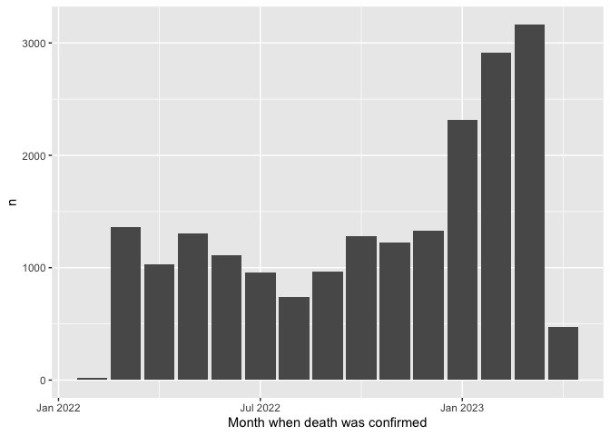
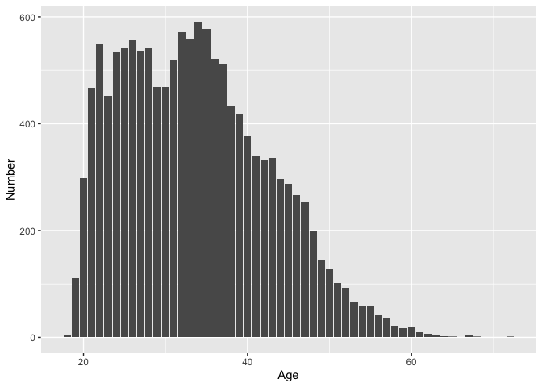
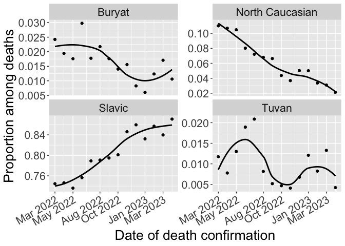
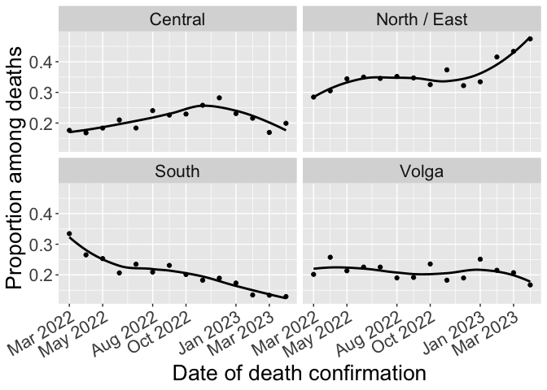

Russian military fatalities in Ukraine
================
April 2023

#### The replication analysis for A.Bessudnov. (2023). “Ethnic and regional inequalities in the Russian military fatalities in Ukraine: Preliminary findings from crowdsourced data”. SocArXiv. <https://osf.io/preprints/socarxiv/s43yf> . DOI 10.31235/osf.io/s43yf .

``` r
library(tidyverse)
library(geofacet)
library(DescTools)
library(Hmisc)
library(ggpubr)
library(lubridate)
library(zoo)

options(tibble.width = Inf)

df <- read_csv("dfFatalities12April2023.csv")
```

## Total number of fatalities in the data set

``` r
df |>
  count()
```

    ## # A tibble: 1 × 1
    ##       n
    ##   <int>
    ## 1 20253

## Fatalities over time

``` r
df |>
  mutate(monthDeath = as.yearmon(deathConfirmedDate)) |>
  count(monthDeath) |>
  ggplot(aes(x = monthDeath, y = n)) +
  geom_col() +
  xlab("Month when death was confirmed")
```

<!-- -->

## Number of men killed and mortality rate per capita by region

``` r
# Read the 2021 census data.

census2021 <- read_csv("census2021_nMen16-615.csv")

# This file has a variable nMen16_615_2021: the number of men in the working age (16-61.5) by region
# as per census 2021 (2020).

# Number of men killed by region and mortality rate per 100,000 men aged 16-61.5

table_mortRates <- df |>
  filter(!is.na(region)) |>
  count(region) |>
  # join with the census data
  left_join(census2021, by = c("region" = "regNameEng")) |>
  # calculate mortality rate per 100,000 men, with confidence intervals
  mutate(mortalityRate = map2(n, nMen16_615_2021, ~ prop.test(.x, .y, conf.level=0.95) |>
                                     broom::tidy())) |>
  unnest(mortalityRate) |>
  mutate(mortalityRate = estimate * 100000) |>
  mutate(mortalityRate_lowCI = conf.low * 100000) |>
  mutate(mortalityRate_highCI = conf.high * 100000) |>
  arrange(-mortalityRate) |>
  select(region, regNameISO, n, nMen16_615_2021, mortalityRate, mortalityRate_lowCI, mortalityRate_highCI) 

table_mortRates |>
  print(n = Inf)
```

    ## # A tibble: 85 × 7
    ##    region              regNameISO     n nMen16_615_2021 mortalityRate
    ##    <chr>               <chr>      <int>           <dbl>         <dbl>
    ##  1 Tuva                TY           231           92884        249.  
    ##  2 Buryatia            BU           643          278885        231.  
    ##  3 Nenets              NEN           27           12717        212.  
    ##  4 Zabaykalsky         ZAB          476          297873        160.  
    ##  5 Magadan             MAG           66           45707        144.  
    ##  6 Chukotka            CHU           23           16138        143.  
    ##  7 Altai Republic      AL            78           58226        134.  
    ##  8 Sakhalin            SAK          182          147268        124.  
    ##  9 North Ossetia       SE           229          207166        111.  
    ## 10 Pskov               PSK          187          173864        108.  
    ## 11 Kostroma            KOS          163          161784        101.  
    ## 12 Komi                KO           214          221218         96.7 
    ## 13 Karelia             KR           139          150418         92.4 
    ## 14 Bryansk             BRY          295          345546         85.4 
    ## 15 Arkhangelsk         ARK          236          284986         82.8 
    ## 16 Kurgan              KGN          164          213102         77.0 
    ## 17 Mari El             ME           148          197794         74.8 
    ## 18 Orenburg            ORE          401          538936         74.4 
    ## 19 Khakassia           KK           111          150548         73.7 
    ## 20 Kursk               KRS          224          310158         72.2 
    ## 21 Kirov               KIR          231          321441         71.9 
    ## 22 Kamchatka           KAM           67           95111         70.4 
    ## 23 Ulyanovsk           ULY          244          347851         70.1 
    ## 24 Yevreyskaya         YEV           31           45466         68.2 
    ## 25 Volgograd           VGG          526          787188         66.8 
    ## 26 Chelyabinsk         CHE          668         1008253         66.3 
    ## 27 Perm                PER          482          733107         65.7 
    ## 28 Astrakhan           AST          186          288596         64.4 
    ## 29 Murmansk            MUR          137          213224         64.3 
    ## 30 Sverdlovsk          SVE          804         1284804         62.6 
    ## 31 Kaliningrad         KGD          198          320095         61.9 
    ## 32 Vologda             VLG          202          330328         61.2 
    ## 33 Kalmykia            KL            48           80177         59.9 
    ## 34 Novgorod            NGR           96          162326         59.1 
    ## 35 Belgorod            BEL          264          453917         58.2 
    ## 36 Oryol               ORL          119          207507         57.3 
    ## 37 Udmurtia            UD           232          418157         55.5 
    ## 38 Tambov              TAM          158          289077         54.7 
    ## 39 Primorsky           PRI          312          576846         54.1 
    ## 40 Ivanovo             IVA          144          266919         53.9 
    ## 41 Adygea              AD            76          145977         52.1 
    ## 42 Saratov             SAR          384          739119         52.0 
    ## 43 Omsk                OMS          274          545368         50.2 
    ## 44 Samara              SAM          470          938500         50.1 
    ## 45 Dagestan            DA           495          990582         50.0 
    ## 46 Bashkortostan       BA           612         1239319         49.4 
    ## 47 Altai Krai          ALT          290          593766         48.8 
    ## 48 Tver                TVE          175          361629         48.4 
    ## 49 Irkutsk             IRK          330          684291         48.2 
    ## 50 Chuvashia           CU           165          342404         48.2 
    ## 51 Sevastopol          UA-40         84          179931         46.7 
    ## 52 Ryazan              RYA          148          319814         46.3 
    ## 53 Krasnodar           KDA          817         1788305         45.7 
    ## 54 Krasnoyarsk         KYA          396          867922         45.6 
    ## 55 Tyumen              TYU          199          454731         43.8 
    ## 56 Stavropol           STA          385          892044         43.2 
    ## 57 Sakha               SA           133          309283         43.0 
    ## 58 Lipetsk             LIP          140          332336         42.1 
    ## 59 Nizhny Novgorod     NIZ          382          912761         41.9 
    ## 60 Chechnya            CE           193          462280         41.7 
    ## 61 Vladimir            VLA          165          395638         41.7 
    ## 62 Amur                AMU           99          239274         41.4 
    ## 63 Voronezh            VOR          285          692268         41.2 
    ## 64 Penza               PNZ          148          365483         40.5 
    ## 65 Novosibirsk         NVS          330          821000         40.2 
    ## 66 Rostov              ROS          503         1274849         39.5 
    ## 67 Yaroslavl           YAR          133          344538         38.6 
    ## 68 Smolensk            SMO          100          262742         38.1 
    ## 69 Crimea              UA-43        203          557147         36.4 
    ## 70 Tomsk               TOM          113          321782         35.1 
    ## 71 Karachay-Cherkessia KC            48          139233         34.5 
    ## 72 Kemerovo            KEM          260          754643         34.5 
    ## 73 Khabarovsk          KHA          134          403638         33.2 
    ## 74 Kabardino-Balkaria  KB            89          275463         32.3 
    ## 75 Tatarstan           TA           372         1191152         31.2 
    ## 76 Mordovia            MO            73          237055         30.8 
    ## 77 Yamalo-Nenets       YAN           52          169683         30.6 
    ## 78 Khanty-Mansi        KHM          164          548522         29.9 
    ## 79 Leningrad           LEN          186          639765         29.1 
    ## 80 Tula                TUL          115          441544         26.0 
    ## 81 Kaluga              KLU           85          330134         25.7 
    ## 82 Ingushetia          IN            38          173094         22.0 
    ## 83 Moscow Oblast       MOS          366         2812520         13.0 
    ## 84 St.Petersburg       SPE          175         1711227         10.2 
    ## 85 Moscow              MOW          125         4096435          3.05
    ##    mortalityRate_lowCI mortalityRate_highCI
    ##                  <dbl>                <dbl>
    ##  1              218.                 283.  
    ##  2              213.                 249.  
    ##  3              143.                 313.  
    ##  4              146.                 175.  
    ##  5              113.                 185.  
    ##  6               92.5                217.  
    ##  7              107.                 168.  
    ##  8              107.                 143.  
    ##  9               96.9                126.  
    ## 10               92.9                124.  
    ## 11               86.1                118.  
    ## 12               84.4                111.  
    ## 13               78.0                109.  
    ## 14               76.0                 95.8 
    ## 15               72.7                 94.3 
    ## 16               65.8                 89.9 
    ## 17               63.5                 88.2 
    ## 18               67.4                 82.1 
    ## 19               60.9                 89.1 
    ## 20               63.2                 82.5 
    ## 21               63.0                 81.9 
    ## 22               55.0                 90.0 
    ## 23               61.7                 79.7 
    ## 24               47.1                 98.1 
    ## 25               61.3                 72.8 
    ## 26               61.4                 71.5 
    ## 27               60.1                 72.0 
    ## 28               55.7                 74.6 
    ## 29               54.1                 76.2 
    ## 30               58.4                 67.1 
    ## 31               53.7                 71.3 
    ## 32               53.1                 70.3 
    ## 33               44.6                 80.1 
    ## 34               48.2                 72.5 
    ## 35               51.5                 65.7 
    ## 36               47.7                 68.9 
    ## 37               48.7                 63.2 
    ## 38               46.6                 64.1 
    ## 39               48.3                 60.5 
    ## 40               45.7                 63.7 
    ## 41               41.3                 65.5 
    ## 42               46.9                 57.5 
    ## 43               44.5                 56.6 
    ## 44               45.7                 54.9 
    ## 45               45.7                 54.6 
    ## 46               45.6                 53.5 
    ## 47               43.5                 54.9 
    ## 48               41.6                 56.3 
    ## 49               43.2                 53.8 
    ## 50               41.2                 56.3 
    ## 51               37.5                 58.1 
    ## 52               39.3                 54.5 
    ## 53               42.6                 49.0 
    ## 54               41.3                 50.4 
    ## 55               38.0                 50.4 
    ## 56               39.0                 47.7 
    ## 57               36.1                 51.1 
    ## 58               35.6                 49.9 
    ## 59               37.8                 46.3 
    ## 60               36.2                 48.2 
    ## 61               35.7                 48.7 
    ## 62               33.8                 50.6 
    ## 63               36.6                 46.3 
    ## 64               34.3                 47.7 
    ## 65               36.0                 44.8 
    ## 66               36.1                 43.1 
    ## 67               32.4                 45.9 
    ## 68               31.1                 46.5 
    ## 69               31.7                 41.9 
    ## 70               29.1                 42.4 
    ## 71               25.7                 46.1 
    ## 72               30.5                 39.0 
    ## 73               27.9                 39.4 
    ## 74               26.1                 40.0 
    ## 75               28.2                 34.6 
    ## 76               24.3                 38.9 
    ## 77               23.1                 40.5 
    ## 78               25.6                 34.9 
    ## 79               25.1                 33.6 
    ## 80               21.6                 31.4 
    ## 81               20.7                 32.0 
    ## 82               15.8                 30.5 
    ## 83               11.7                 14.4 
    ## 84                8.79                11.9 
    ## 85                2.55                 3.65

## Map of mortality rates by region

``` r
# This sets a grid for a map.

ru_federal_subjects_2022 <- data.frame(
  row = c(1, 1, 2, 2, 2, 2, 2, 3, 3, 3, 3, 3, 3, 3, 3, 3, 4, 4, 4, 4, 4, 4, 4, 
          4, 4, 4, 4, 4, 4, 4, 4, 4, 4, 5, 5, 5, 5, 5, 5, 5, 5, 5, 5, 5, 5, 5, 
          5, 6, 6, 6, 6, 6, 6, 6, 6, 6, 6, 6, 6, 6, 6, 7, 7, 7, 7, 7, 7, 7, 8, 
          8, 8, 9, 9, 9, 9, 9, 9, 9, 10, 10, 10, 10, 11, 11, 11),
  col = c(1, 5, 17, 18, 4, 10, 1, 11, 16, 17, 3, 4, 5, 9, 10, 14, 11, 12, 8, 9,  
          10, 16, 17, 19, 1, 3, 13, 14, 15, 4, 5, 6, 7, 11, 12, 7, 8, 9, 10, 16,
          13, 14, 15, 3, 4, 5, 6, 11, 7, 8, 9, 10, 17, 12, 13, 14, 15, 3, 4, 5, 
          6, 7, 8, 9, 14, 4, 5, 6, 5, 6, 7, 2, 4, 5, 6, 7, 8, 1, 5, 6, 7, 8, 5, 6, 7),
  code = c("SPE", "MUR", "CHU", "KAM", "KR", "NEN", "MOW", "YAN", "SA", 
           "MAG", "LEN", "NGR", "VLG", "ARK", "KO", "KYA", "KHM", "TYU", 
           "ME", "KIR", "PER", "AMU", "KHA", "SAK", "KGD", "PSK", "TOM", 
           "KEM", "IRK", "TVE", "YAR", "IVA", "KOS", "SVE", "KGN", "NIZ", 
           "CU", "TA", "UD", "YEV", "NVS", "KK", "BU", "SMO", "KLU", 
           "MOS", "VLA", "CHE", "MO", "ULY", "SAM", "BA", "PRI", "OMS", 
           "ALT", "TY", "ZAB", "BRY", "ORL", "TUL", "RYA", "PNZ", "SAR", 
           "ORE", "AL", "KRS", "LIP", "TAM", "BEL", "VOR", "VGG", "UA-43", 
           "AD", "KDA", "ROS", "KL", "AST",  "UA-40" ,"KC", "STA", "CE", "DA", 
           "KB", "SE", "IN"),
  name = c("St.Petersburg", "Murmansk", "Chukotka", 
           "Kamchatka", "Karelia", "Nenets", 
           "Moscow", "Yamalo-Nenets", "Sakha", 
           "Magadan", "Leningrad", "Novgorod", 
           "Vologda", "Arkhangelsk", "Komi", 
           "Krasnoyarsk", "Khanty-Mansi", 
           "Tyumen", "Mari El", "Kirov", 
           "Perm", "Amur", "Khabarovsk", 
           "Sakhalin", "Kaliningrad", "Pskov", 
           "Tomsk", "Kemerovo", "Irkutsk", 
           "Tver", "Yaroslavl", "Ivanovo", 
           "Kostroma", "Sverdlovsk", "Kurgan", 
           "Nizhny Novgorod", "Chuvashia", "Tatarstan", 
           "Udmurtia", "Yevreyskaya", 
           "Novosibirsk", "Khakassia", "Buryatia", 
           "Smolensk", "Kaluga", "Moscow Oblast", 
           "Vladimir", "Chelyabinsk", "Mordovia", 
           "Ulyanovsk", "Samara", "Bashkortostan", 
           "Primorsky", "Omsk", "Altai Krai", "Tuva", 
           "Zabaykalsky", "Bryansk", "Oryol", 
           "Tula", "Ryazan", "Penza", 
           "Saratov", "Orenburg", "Altai Republic", 
           "Kursk", "Lipetsk", "Tambov", 
           "Belgorod", "Voronezh", "Volgograd", 
           "Crimea", "Adygea", "Krasnodar", 
           "Rostov", "Kalmykia", "Astrakhan", 
           "Sevastopol",
           "Karachay-Cherkessia", "Stavropol", 
           "Chechnya", "Dagestan", 
           "Kabardino-Balkaria", "North Ossetia", 
           "Ingushetia"),
  stringsAsFactors = FALSE
)

df_map_mortRates <- table_mortRates |>
  select(regNameISO, mortalityRate) |>
  rename(code = regNameISO) |>
  mutate(x = rep(1,85),
         y = rep(1,85))

# Map

map1 <- ggplot(df_map_mortRates, aes(x = x, y = y, fill = log(mortalityRate), label = code)) +
  geom_col() +
  geom_text(x = 1, y = 0.5, size = 4) +
  facet_geo(~ code, grid = ru_federal_subjects_2022) +
  theme_void() +
  theme(
    strip.background = element_blank(),
    strip.text.x = element_blank()
  ) +
  labs(fill="Log mortality rate \n(per 100,000 men)") +
  scale_fill_distiller(palette = "Spectral", direction = -1)

map1
```

<!-- -->

## Relative risks by ethnic group for Russia

``` r
# Number and proportion among the dead by ethnic group (assumed from the name)

df |>
  count(impliedEthnicity) |>
  mutate(perc = n / sum(n)) |>
  arrange(-n)
```

    ## # A tibble: 16 × 3
    ##    impliedEthnicity     n     perc
    ##    <chr>            <int>    <dbl>
    ##  1 BelRusUkr        16455 0.812   
    ##  2 BashTat           1049 0.0518  
    ##  3 CheDagIng          827 0.0408  
    ##  4 KabAdKarBalOs      342 0.0169  
    ##  5 Buryat             317 0.0157  
    ##  6 KazKyr             309 0.0153  
    ##  7 Tuvan              210 0.0104  
    ##  8 TajUzb             201 0.00992 
    ##  9 Jewish             164 0.00810 
    ## 10 Armenian           114 0.00563 
    ## 11 Azerbaijani         87 0.00430 
    ## 12 Moldovan            87 0.00430 
    ## 13 Kalmyk              41 0.00202 
    ## 14 Georgian            29 0.00143 
    ## 15 Yakut               17 0.000839
    ## 16 INVALID              4 0.000198

``` r
# read in the data from census 2010 on ethnic proportions in the male Russian population
# (aged 8 to 32 at the time of the 2010 census, corresponding to 20 to 44 in 2022)
# (Note that people with missing data on ethnicity were excluded from the calculation of proportions)

census2010EthnPropPopulationAll <- read_csv("census2010EthnPropPopulationAll.csv")

# aggregated and compared with the 2010 proportions

df_relRisk <- df |>
  mutate(newEthn = case_when(
    impliedEthnicity == "BelRusUkr" ~ "BelRusUkr",
    impliedEthnicity == "BashTat" ~ "BashTat",
    impliedEthnicity == "CheDagIng" ~ "CheDagIngKabAdKarBalOs",
    impliedEthnicity == "KabAdKarBalOs" ~ "CheDagIngKabAdKarBalOs",
    impliedEthnicity == "Buryat" ~ "Buryat",
    impliedEthnicity == "Tuvan" ~ "Tuvan",
    TRUE ~ "other"
  )) |>
  count(newEthn) |>
  mutate(sumKilled = sum(n)) |>
  mutate(prop = n / sum(n)) |>
  # join in data from the 2010 census
  full_join(census2010EthnPropPopulationAll, by = "newEthn") |>
  mutate(relRisk = prop / propPopulation) |>
  mutate(relRisk_4_50 = prop / propPopulation_4_50) |>
  mutate(relRisk_8_32 = prop / propPopulation_8_32) |>
  arrange(-relRisk_8_32)


df_relRisk
```

    ## # A tibble: 6 × 16
    ##   newEthn                    n sumKilled   prop nPopulation sumPopulation
    ##   <chr>                  <int>     <int>  <dbl>       <dbl>         <dbl>
    ## 1 Tuvan                    210     20253 0.0104      105160      60739860
    ## 2 Buryat                   317     20253 0.0157      210730      60739860
    ## 3 BashTat                 1049     20253 0.0518     2898185      60739860
    ## 4 BelRusUkr              16455     20253 0.812     49605085      60739860
    ## 5 CheDagIngKabAdKarBalOs  1169     20253 0.0577     3227405      60739860
    ## 6 other                   1053     20253 0.0520     4693295      60739860
    ##   propPopulation nPopulation_4_50 sumPopulation_4_50 propPopulation_4_50
    ##            <dbl>            <dbl>              <dbl>               <dbl>
    ## 1        0.00173            81940           41185370             0.00199
    ## 2        0.00347           155245           41185370             0.00377
    ## 3        0.0477           1981835           41185370             0.0481 
    ## 4        0.817           33215705           41185370             0.806  
    ## 5        0.0531           2478900           41185370             0.0602 
    ## 6        0.0773           3271745           41185370             0.0794 
    ##   nPopulation_8_32 sumPopulation_8_32 propPopulation_8_32 relRisk relRisk_4_50
    ##              <dbl>              <dbl>               <dbl>   <dbl>        <dbl>
    ## 1            49050           22032860             0.00223   5.99         5.21 
    ## 2            89940           22032860             0.00408   4.51         4.15 
    ## 3          1053685           22032860             0.0478    1.09         1.08 
    ## 4         17734430           22032860             0.805     0.995        1.01 
    ## 5          1423855           22032860             0.0646    1.09         0.959
    ## 6          1681900           22032860             0.0763    0.673        0.654
    ##   relRisk_8_32
    ##          <dbl>
    ## 1        4.66 
    ## 2        3.83 
    ## 3        1.08 
    ## 4        1.01 
    ## 5        0.893
    ## 6        0.681

``` r
# calculate confidence intervals for the risk ratios with DescTools (RelRisk())

# The data should be presented as a 2x2 matrix.
# In the first row: n killed / (n total in the data - n killed)
# In the second row: n ethnic group (male pop 2010) / (n all men 2010 - n ethnic group male 2010)

# This function calculates relative risk with 95% CIs for an ethnic group.
relRiskCI <- function(x, ethn = ethn) {
    x |>
    filter(newEthn == ethn) |>
    select(n, sumKilled, nPopulation_8_32, sumPopulation_8_32) |>
    rename(nKilled = n) |>
    mutate(nNotKilled = sumKilled - nKilled) |>
    mutate(nPop_minusGroup_8_32 = sumPopulation_8_32 - nPopulation_8_32) |>
    select(nKilled, nNotKilled, nPopulation_8_32, nPop_minusGroup_8_32) |>
    as.numeric() |>
    matrix(nrow = 2, byrow = TRUE) |>
    RelRisk(conf.level = 0.95) 
}

# An example for Tuvans

relRiskCI(df_relRisk, ethn = "Tuvan")
```

    ## rel. risk    lwr.ci    upr.ci 
    ##  4.657596  4.070133  5.328843

``` r
# Risk ratios with CIs for all ethnic groups

df_RR_results <- data.frame()
df_RR_results
```

    ## data frame with 0 columns and 0 rows

``` r
k <- 1
for (i in df_relRisk$newEthn) {
  df_RR_results <- rbind(df_RR_results, c(i, relRiskCI(df_relRisk, ethn = i)))
  k <- k + 1
}
colnames(df_RR_results) <- c("ethn", "relRisk", "lowRelRiskCI", "highRelRiskCI")

df_RR_results
```

    ##                     ethn           relRisk      lowRelRiskCI     highRelRiskCI
    ## 1                  Tuvan  4.65759578639084  4.07013321687455   5.3288434056666
    ## 2                 Buryat  3.83431590601264  3.43681084429646   4.2769885237114
    ## 3                BashTat  1.08304425450758  1.02095271800795  1.14869436244655
    ## 4              BelRusUkr  1.00939735964268  1.00264225491196  1.01600546818495
    ## 5 CheDagIngKabAdKarBalOs 0.893162043533286 0.844728015121644 0.944194179479013
    ## 6                  other 0.681098169045104 0.642133560495184 0.722290218197014

## For some ethnic republics: proportion ethnic Russian names dead vs proportion of ethnic non-Russian names dead

Republics to explore: Buryatia, Tuva, North Ossetia, Dagestan, Chechnya,
Ingushetia, Adygeya, Bashkortostan, Kalmykia, Kabardino-Balkaria,
Tatarstan, Karachaevo-Chekessiya, Astrakhan.

Risk ratios calculated with the data on male population aged 8 to 32 in
2010 (20 to 44 in 2022).

``` r
# Read in the 2010 census data with the data on the ethnic composition by region

census_2010_ethn <- read_csv("census_2010_ethn.csv")

df_relRisk_region <- df |>
  filter(region %in% c("Buryatia", "Tuva", "North Ossetia",
                       "Dagestan", "Astrakhan", "Chechnya",
                       "Adygea", "Ingushetia", "Bashkortostan",
                       "Kalmykia", "Kabardino-Balkaria", "Tatarstan",
                       "Karachay-Cherkessia")) |>
  mutate(ethnRusUkrBel = case_when(
    impliedEthnicity == "BelRusUkr" ~ 1,
    TRUE ~ 0
  )) |>
  mutate(nonethnRusUkrBel = case_when(
    impliedEthnicity == "BelRusUkr" ~ 0,
    TRUE ~ 1
  )) |>
  group_by(region) |>
  summarise(
    nKilled = n(),
    nEthnRusUkrBel_killed = sum(ethnRusUkrBel, na.rm = TRUE),
    nNonEthnRusUkrBel_killed = sum(nonethnRusUkrBel, na.rm = TRUE)
  ) |>
  # join with the census data
  left_join(census_2010_ethn, by = c("region" = "regNameEng")) |>
  select(region, nKilled, nNonEthnRusUkrBel_killed, nMen_ethn_nonmissing, nMen_ethn_nonmissing_4_50, nMen_ethn_nonmissing_8_32, nRusUkrBelMen, nRusUkrBelMen_4_50, nRusUkrBelMen_8_32) |>
  mutate(propNonRusDead = nNonEthnRusUkrBel_killed / nKilled) |>
  mutate(propNonRusAll = (nMen_ethn_nonmissing - nRusUkrBelMen) / nMen_ethn_nonmissing) |>
  mutate(propNonRusAll_4_50 = (nMen_ethn_nonmissing_4_50 - nRusUkrBelMen_4_50) / nMen_ethn_nonmissing_4_50) |>
  mutate(propNonRusAll_8_32 = (nMen_ethn_nonmissing_8_32 - nRusUkrBelMen_8_32) / nMen_ethn_nonmissing_8_32) |>
  mutate(rr = propNonRusDead / propNonRusAll) |>
  mutate(rr_4_50 = propNonRusDead / propNonRusAll_4_50) |>
  mutate(rr_8_32 = propNonRusDead / propNonRusAll_8_32)


df_relRisk_region |>
  arrange(-rr_8_32) |>
  print(n = Inf)
```

    ## # A tibble: 13 × 16
    ##    region              nKilled nNonEthnRusUkrBel_killed nMen_ethn_nonmissing
    ##    <chr>                 <int>                    <dbl>                <dbl>
    ##  1 Astrakhan               186                       91               397535
    ##  2 Buryatia                643                      244               429355
    ##  3 Tuva                    231                      208               129555
    ##  4 Chechnya                193                      191               565895
    ##  5 Dagestan                495                      480              1348385
    ##  6 Bashkortostan           612                      389              1814845
    ##  7 Ingushetia               38                       37               162485
    ##  8 Kalmykia                 48                       33               133190
    ##  9 Kabardino-Balkaria       89                       67               389660
    ## 10 North Ossetia           229                      158               312450
    ## 11 Karachay-Cherkessia      48                       28               212625
    ## 12 Tatarstan               372                      167              1643755
    ## 13 Adygea                   76                       18               191695
    ##    nMen_ethn_nonmissing_4_50 nMen_ethn_nonmissing_8_32 nRusUkrBelMen
    ##                        <dbl>                     <dbl>         <dbl>
    ##  1                    271435                    147090        266915
    ##  2                    303835                    170255        283190
    ##  3                     97865                     56210         21890
    ##  4                    434545                    265850          5620
    ##  5                   1045985                    618990         40420
    ##  6                   1248570                    676610        661380
    ##  7                    125375                     75680          1065
    ##  8                     93845                     52630         39715
    ##  9                    282660                    160255         82215
    ## 10                    217380                    119265         59795
    ## 11                    149140                     82685         64805
    ## 12                   1127830                    613920        640570
    ## 13                    126180                     68075        120630
    ##    nRusUkrBelMen_4_50 nRusUkrBelMen_8_32 propNonRusDead propNonRusAll
    ##                 <dbl>              <dbl>          <dbl>         <dbl>
    ##  1             176105              94410          0.489         0.329
    ##  2             196010             108825          0.379         0.340
    ##  3              14805               7760          0.900         0.831
    ##  4               4410               2615          0.990         0.990
    ##  5              27495              15785          0.970         0.970
    ##  6             444260             243185          0.636         0.636
    ##  7                780                435          0.974         0.993
    ##  8              25475              13465          0.688         0.702
    ##  9              53670              29080          0.753         0.789
    ## 10              39390              21350          0.690         0.809
    ## 11              42630              22935          0.583         0.695
    ## 12             432990             238755          0.449         0.610
    ## 13              77310              41130          0.237         0.371
    ##    propNonRusAll_4_50 propNonRusAll_8_32    rr rr_4_50 rr_8_32
    ##                 <dbl>              <dbl> <dbl>   <dbl>   <dbl>
    ##  1              0.351              0.358 1.49    1.39    1.37 
    ##  2              0.355              0.361 1.11    1.07    1.05 
    ##  3              0.849              0.862 1.08    1.06    1.04 
    ##  4              0.990              0.990 1.00    1.00    0.999
    ##  5              0.974              0.974 1.00    0.996   0.995
    ##  6              0.644              0.641 1.00    0.987   0.992
    ##  7              0.994              0.994 0.980   0.980   0.979
    ##  8              0.729              0.744 0.980   0.944   0.924
    ##  9              0.810              0.819 0.954   0.929   0.920
    ## 10              0.819              0.821 0.853   0.843   0.840
    ## 11              0.714              0.723 0.839   0.817   0.807
    ## 12              0.616              0.611 0.736   0.729   0.735
    ## 13              0.387              0.396 0.639   0.612   0.598

``` r
# a function to calculate relative risks by region with confidence intervals
  
relRiskCI_region <- function(x, regName = region) {
    x |>
    filter(region == regName) |>
    select(nKilled, nNonEthnRusUkrBel_killed, nMen_ethn_nonmissing_8_32, nRusUkrBelMen_8_32) |>
    mutate(nRusUkrBelKilled = nKilled - nNonEthnRusUkrBel_killed) |>
    mutate(nNonRusPop_8_32 = nMen_ethn_nonmissing_8_32 - nRusUkrBelMen_8_32) |>
    select(nNonEthnRusUkrBel_killed, nRusUkrBelKilled, nNonRusPop_8_32, nRusUkrBelMen_8_32) |>
    as.numeric() |>
    matrix(nrow = 2, byrow = TRUE) |>
    RelRisk(conf.level = 0.95) 
}

# An example for Tuva.

relRiskCI_region(df_relRisk_region, regName = "Tuva")
```

    ## rel. risk    lwr.ci    upr.ci 
    ## 1.0446508 0.9918908 1.0823274

``` r
# Risk ratios with CIs for all regions

df_RR_results_region <- data.frame()
df_RR_results_region
```

    ## data frame with 0 columns and 0 rows

``` r
k <- 1
for (i in df_relRisk_region$region) {
  df_RR_results_region <- rbind(df_RR_results_region, c(i, relRiskCI_region(df_relRisk_region, regName = i)))
  k <- k + 1
}
colnames(df_RR_results_region) <- c("region", "relRisk", "lowRelRiskCI", "highRelRiskCI")

df_RR_results_region
```

    ##                 region           relRisk      lowRelRiskCI     highRelRiskCI
    ## 1               Adygea 0.598368020626813 0.392554345972246 0.868231421631043
    ## 2            Astrakhan  1.36604759105494  1.16794396232302  1.56549395929476
    ## 3        Bashkortostan 0.992253486347722 0.931560344738832  1.05031409646329
    ## 4             Buryatia   1.0517153512615 0.949855847386079   1.1576107868384
    ## 5             Chechnya 0.999468451080621 0.972619925815124  1.00707414719138
    ## 6             Dagestan 0.995072533007398 0.975479376635637  1.00724592046793
    ## 7           Ingushetia 0.979313190944669 0.869484711090953  1.00110574138282
    ## 8   Kabardino-Balkaria 0.919698147470036 0.798946381494387  1.01491146204799
    ## 9             Kalmykia 0.923863781437508 0.734580420457729  1.07588375570629
    ## 10 Karachay-Cherkessia 0.807245467224547 0.612769196001408 0.984667847593793
    ## 11       North Ossetia 0.840398732792702 0.764094027993498 0.909088134870983
    ## 12           Tatarstan  0.73462042292789 0.653173322529012  0.81778141747231
    ## 13                Tuva  1.04465084279326 0.991890803874345  1.08232735911554

The relative risk shows if ethnic minorities are more likely to die than
ethnic Russians. If RR \> 1 ethnic minority names are more common among
the dead, if RR \< 1 the ethnic minority names are less common.

## Distribution by age

``` r
# mean age
df |>
  summarise(
    mean(age, na.rm = TRUE)
  )
```

    ## # A tibble: 1 × 1
    ##   `mean(age, na.rm = TRUE)`
    ##                       <dbl>
    ## 1                      33.7

``` r
# distribution by age

df |>
  ggplot(aes(x = age)) +
  geom_bar() +
  xlab("Age") +
  ylab("Number")
```

<!-- -->

## Number of deaths and proportion Slavic by type of military force

``` r
df |>
  mutate(BelRusUkr = case_when(
      impliedEthnicity == "BelRusUkr" ~ 1,
      TRUE ~ 0
    )) |>
  group_by(unitType) |>
  summarise(
    nType = n(),
    propSlavic = mean(BelRusUkr, na.rm = TRUE)
    ) |>
  mutate(propType = nType / sum(nType)) |>
  select(unitType, nType, propType, propSlavic)
```

    ## # A tibble: 7 × 4
    ##   unitType                      nType propType propSlavic
    ##   <chr>                         <int>    <dbl>      <dbl>
    ## 1 conscripted                    1856   0.0916      0.848
    ## 2 inmates                        2949   0.146       0.859
    ## 3 police / national guard / FSB   519   0.0256      0.628
    ## 4 private military company       1091   0.0539      0.861
    ## 5 professional army              6741   0.333       0.793
    ## 6 volunteers                     2049   0.101       0.795
    ## 7 <NA>                           5048   0.249       0.814

## Deaths by month and type of military unit

``` r
unitType12Apr <- df |>
  mutate(monthDeath = as.yearmon(deathConfirmedDate)) |>
  mutate(unitType = case_when(
    is.na(unitType) ~ "missing data",
    TRUE ~ unitType
  )) |>
  mutate(unitType = factor(unitType,
            levels = c("inmates", "private military company", "conscripted", "volunteers",
                       "police / national guard / FSB", "professional army", "missing data"))) |>
  filter(!is.na(monthDeath)) |>
  count(unitType, monthDeath) |>
  ggplot(aes(x = monthDeath, y = n, fill = unitType)) +
  geom_col() +
  ylab("Number of deaths") +
  xlab("Date of death confirmation") +
  # theme(axis.text.x = element_text(angle = 30, hjust = 1)) +
  labs(fill = "Unit type") +
  theme(text = element_text(size=20))

unitType12Apr
```

<!-- -->

## Changes over time by ethnic group and region

``` r
ethnTrend12Apr <- df |>
  mutate(newEthn = case_when(
    impliedEthnicity == "BelRusUkr" ~ "Slavic",
    impliedEthnicity == "BashTat" ~ "BashTat",
    impliedEthnicity == "CheDagIng" ~ "North Caucasian",
    impliedEthnicity == "KabAdKarBalOs" ~ "North Caucasian",
    impliedEthnicity == "Buryat" ~ "Buryat",
    impliedEthnicity == "Tuvan" ~ "Tuvan",
    TRUE ~ "other"
  )) |>
  mutate(monthDeath = as.yearmon(deathConfirmedDate)) |>
  count(monthDeath, newEthn) |>
  group_by(monthDeath) |>
  mutate(propMonth = n / sum(n)) |>
  filter(newEthn %in% c("Slavic", "Buryat", "Tuvan", "North Caucasian")) |>
  filter(monthDeath > "Feb 2022") |>
  ggplot(
    aes(x = monthDeath, y = propMonth)
  ) +
  geom_point() +
  geom_smooth(colour = "black", se = FALSE) +
  xlab("Date of death confirmation") +
  ylab("Proportion among deaths") +
  theme(axis.text.x = element_text(angle = 30, hjust = 1)) +
  facet_wrap(~ newEthn, scales="free_y") +
  theme(text = element_text(size=20))

ethnTrend12Apr 
```

<!-- -->

``` r
dfMacroRegionMonth <- df |>
  mutate(macroRegion = case_when(
      region == "Arkhangelsk" ~ "North / East",
      region == "Nenets" ~ "North / East",
      region == "Tyumen" ~ "North / East",
      region == "Khanty-Mansi" ~ "North / East",
      region == "Yamalo-Nenets" ~ "North / East",
      region == "Altai Krai" ~ "North / East",
      region == "Krasnodar" ~ "South",
      region == "Krasnoyarsk" ~ "North / East",
      region == "Primorsky" ~ "North / East",
      region == "Stavropol" ~ "South",
      region == "Khabarovsk" ~ "North / East",
      region == "Amur" ~ "North / East",
      region == "Astrakhan" ~ "South",
      region == "Belgorod" ~ "Central",
      region == "Bryansk" ~ "Central",
      region == "Vladimir" ~ "Central",
      region == "Volgograd" ~ "South",
      region == "Vologda" ~ "Central",
      region == "Voronezh" ~ "Central",
      region == "Nizhny Novgorod" ~ "Volga",
      region == "Ivanovo" ~ "Central",
      region == "Irkutsk" ~ "North / East",
      region == "Ingushetia" ~ "South",
      region == "Kaliningrad" ~ "Central",
      region == "Tver" ~ "Central",
      region == "Kaluga" ~ "Central",
      region == "Kamchatka" ~ "North / East",
      region == "Kemerovo" ~ "North / East",
      region == "Kirov" ~ "Volga",
      region == "Kostroma" ~ "Central",
      region == "Samara" ~ "Volga",
      region == "Kurgan" ~ "North / East",
      region == "Kursk" ~ "Central",
      region == "St.Petersburg" ~ "Central",
      region == "Leningrad" ~ "Central",
      region == "Lipetsk" ~ "Central",
      region == "Magadan" ~ "North / East",
      region == "Moscow" ~ "Central",
      region == "Moscow Oblast" ~ "Central",
      region == "Murmansk" ~ "North / East",
      region == "Novgorod" ~ "Central",
      region == "Novosibirsk" ~ "North / East",
      region == "Omsk" ~ "North / East",
      region == "Orenburg" ~ "Volga",
      region == "Oryol" ~ "Central",
      region == "Penza" ~ "Volga",
      region == "Perm" ~ "Volga",
      region == "Pskov" ~ "Central",
      region == "Rostov" ~ "South",
      region == "Ryazan" ~ "Central",
      region == "Saratov" ~ "Volga",
      region == "Sakhalin" ~ "North / East",
      region == "Sverdlovsk" ~ "North / East",
      region == "Smolensk" ~ "Central",
      region == "Tambov" ~ "Central",
      region == "Tomsk" ~ "North / East",
      region == "Tula" ~ "Central",
      region == "Ulyanovsk" ~ "Volga",
      region == "Chelyabinsk" ~ "North / East",
      region == "Zabaykalsky" ~ "North / East",
      region == "Chukotka" ~ "North / East",
      region == "Yaroslavl" ~ "Central",
      region == "Adygea" ~ "South",
      region == "Bashkortostan" ~ "Volga",
      region == "Buryatia" ~ "North / East",
      region == "Dagestan" ~ "South",
      region == "Kabardino-Balkaria" ~ "South",
      region == "Altai Republic" ~ "North / East",
      region == "Kalmykia" ~ "South",
      region == "Karelia" ~ "North / East",
      region == "Komi" ~ "North / East",
      region == "Mari El" ~ "Volga",
      region == "Mordovia" ~ "Volga",
      region == "North Ossetia" ~ "South",
      region == "Karachay-Cherkessia" ~ "South",
      region == "Tatarstan" ~ "Volga",
      region == "Tuva" ~ "North / East",
      region == "Udmurtia" ~ "Volga",
      region == "Khakassia" ~ "North / East",
      region == "Chechnya" ~ "South",
      region == "Chuvashia" ~ "Volga",
      region == "Sakha" ~ "North / East",
      region == "Yevreyskaya" ~ "North / East",
      region == "Sevastopol" ~ "South",
      region == "Crimea" ~ "South")
  ) |>
  mutate(monthDeath = as.yearmon(deathConfirmedDate)) |>
  count(monthDeath, macroRegion) |>
  group_by(monthDeath) |>
  mutate(propDeaths = n / sum(n)) 
      
dfMacroRegionMonth 
```

    ## # A tibble: 79 × 4
    ## # Groups:   monthDeath [16]
    ##    monthDeath macroRegion      n propDeaths
    ##    <yearmon>  <chr>        <int>      <dbl>
    ##  1 Feb 2022   Central          2    0.118  
    ##  2 Feb 2022   North / East     1    0.0588 
    ##  3 Feb 2022   South           11    0.647  
    ##  4 Feb 2022   Volga            3    0.176  
    ##  5 Mar 2022   Central        240    0.176  
    ##  6 Mar 2022   North / East   388    0.285  
    ##  7 Mar 2022   South          456    0.335  
    ##  8 Mar 2022   Volga          275    0.202  
    ##  9 Mar 2022   <NA>             4    0.00293
    ## 10 Apr 2022   Central        173    0.168  
    ## # ℹ 69 more rows

``` r
regionTrend12Apr <- dfMacroRegionMonth  |>
   filter(monthDeath > "Feb 2022") |>
   filter(!is.na(macroRegion)) |>
   ggplot(aes(x = monthDeath, y = propDeaths)) +
   geom_point() +
   geom_smooth(colour = "black", se = FALSE) +
  xlab("Date of death confirmation") +
  ylab("Proportion among deaths") +
  theme(axis.text.x = element_text(angle = 30, hjust = 1)) +
  facet_wrap(~ macroRegion)  +
  theme(text = element_text(size=20))

regionTrend12Apr
```

<!-- -->

## Correlations with regional characteristics

``` r
# Read in regional characteristics for 2020:
# percent below the subsistence level
# unemployment rate
# subsistence level (4th quarter 2020)
# mean income per capita

regionData <- read_csv("regionCharacteristics.csv")

# Joining in with the data on regional mortality rates.

regionData_joined <- table_mortRates |>
  select(-regNameISO) |>
  left_join(regionData, by = c("region" = "regNameEng")) |>
  # calculate the regional income / subsistence level ratio
  mutate(incomeToSubsitenceRatio = meanIncome / subsistenceLevel) |>
  select(-regNameISO) |>
  # Join in the data on proportion non-Russian population.
  left_join(census_2010_ethn, by = c("region" = "regNameEng")) |>
  mutate(percentNonRus = 100 - percRus)
```

``` r
# Scatter plots with non-parametric smooth

# Percent non-ethnically Russian populationvs. mortality rate

regionData_joined |>
  ggplot(aes(x = percentNonRus, y = mortalityRate)) +
  geom_point() +
  geom_smooth() +
  xlab("Percent non-ethnically Russian population") +
  ylab("Regional mortality rate")
```

<!-- -->

``` r
# Data for percent non-ethnically Russian for Crimea and Sevastopol are not available from the 2010 census; these regions have been dropped.

# Percent with the incomes below the subsistence level

regionData_joined |>
  ggplot(aes(x = percBelowSubsistence, y = mortalityRate)) +
  geom_point() +
  geom_smooth() +
  xlab("Percent with income below subsistence") +
  ylab("Regional mortality rate")
```

<!-- -->

``` r
# Regression model: mortality rate ~ percent below subsistence level + percent non-Russian

m1 <- lm(mortalityRate ~ percBelowSubsistence + percentNonRus, regionData_joined)

summary(m1)
```

    ## 
    ## Call:
    ## lm(formula = mortalityRate ~ percBelowSubsistence + percentNonRus, 
    ##     data = regionData_joined)
    ## 
    ## Residuals:
    ##     Min      1Q  Median      3Q     Max 
    ## -82.883 -23.328  -9.507   7.194 160.020 
    ## 
    ## Coefficients:
    ##                      Estimate Std. Error t value Pr(>|t|)  
    ## (Intercept)          28.36623   13.85164   2.048   0.0439 *
    ## percBelowSubsistence  2.60051    1.06703   2.437   0.0170 *
    ## percentNonRus        -0.01555    0.20937  -0.074   0.9410  
    ## ---
    ## Signif. codes:  0 '***' 0.001 '**' 0.01 '*' 0.05 '.' 0.1 ' ' 1
    ## 
    ## Residual standard error: 42.42 on 80 degrees of freedom
    ##   (2 observations deleted due to missingness)
    ## Multiple R-squared:  0.08803,    Adjusted R-squared:  0.06523 
    ## F-statistic: 3.861 on 2 and 80 DF,  p-value: 0.02508

``` r
# Plots: mortality rate vs percent below subsistence level and percent non-ethnically Russian

plot1 <- regionData_joined |>
  ggplot(aes(x = percBelowSubsistence, y = mortalityRate, label = regNameISO)) +
  geom_point() +
  geom_smooth(method = "lm") +
  geom_text(nudge_x = 1) +
  stat_cor(aes(label = ..r.label..), size = 8) +
  xlab("Percent of incomes below subsistence level (2020)") +
  ylab("Mortality rate per 100,000 men") +
  theme(axis.title=element_text(size=16))


plot2 <- regionData_joined |>
  ggplot(aes(x = percentNonRus, y = mortalityRate, label = regNameISO)) +
  geom_point() +
  geom_smooth(method = "lm") +
  geom_text(nudge_x = 3) +
  stat_cor(aes(label = ..r.label..), size = 8) +
  xlab("Percent of non-ethnically Russian population (2010)") +
  ylab("Mortality rate per 100,000 men") +
  theme(axis.title=element_text(size=16))


figure2 <- ggarrange(plot1, plot2)
figure2
```

<!-- -->

## Validation with the Yandex data

I collected data on Yandex searches by region
(<https://wordstat.yandex.com/#!/regions>) for two search expressions:
“сво выплаты” (“special military operation payments”, over 25,000
monthly searches) and “выплаты погибшим” (“payments for killed”, over
50,000 monthly searches). The data were collected on 10 February 2023.
These are not historical data so it reflects the situation as in January
2023.

(Update: in another round of data collection, I collected Yandex data on
19 April.)

The data show regional popularity of search term, i.e. the affinity
index which is the regional the share of searches for the
word/expression divided over the total share of all searches in that
region.

The correlation between the Yandex searches and the fatality rate is 0.4
or 0.5, depending on the search term.

``` r
# Reading Yandex searches data

yandex_df <- read_csv("yandex_searches.csv")

# Joining with the fatality rates data

yandex_df <- yandex_df |>
  left_join(table_mortRates, by = "regNameISO")

# "svo vyplaty" (10 Feb)

cor(yandex_df$svo_vyplaty_10Feb, yandex_df$mortalityRate)
```

    ## [1] 0.3610405

``` r
# "vyplaty pogibshim" (10 Feb)

cor(yandex_df$vyplaty_pogibshim_10Feb, yandex_df$mortalityRate)
```

    ## [1] 0.5262979

``` r
# April 2023 data

# vyplaty pogibshim (19 Apr)
cor(yandex_df$vyplaty_pogibshim_19Apr, yandex_df$mortalityRate)
```

    ## [1] 0.612786

``` r
yandex_df |>
  ggplot(aes(x = vyplaty_pogibshim_10Feb, y = mortalityRate, label = regNameISO)) +
  geom_smooth() +
  geom_text() +
  xlab("vyplaty pogibshim search regional affinity index (10 Feb)") +
  ylab("Fatality rate")
```

<!-- -->

``` r
yandex_df |>
  ggplot(aes(x = vyplaty_pogibshim_19Apr, y = mortalityRate, label = regNameISO)) +
  geom_smooth() +
  geom_text() +
  xlab("vyplaty pogibshim search regional affinity index (19 Apr)") +
  ylab("Fatality rate")
```

<!-- -->

## Validation with the Russian Defense Ministry pensions data (June 2023)

In June 2023 the Russian Defence Ministey released statistics on the
number of pensions awarded because of a death or injury of servicemen to
their relatives (“po potere kormiltsa”). See
<https://fedstat.ru/indicator/58153> . The data contain the number of
pensions by region in 2021 and 2022. The data are nor perfect and likely
contain errors (for example, for Omsk region the number of pensioners in
2021 was 1709 and in 2022 415). However, most regions recorded a rapid
increase in the number of pensioners. I look at the percentage increase
in the number of pensioners in 2022 compared to 2021 and compare it to
the fatality rates (for February to November 2022) in the BBC/Mediazona
data

``` r
# Fatality rates by region for death from March to November 2022

table_mortRates2022 <- df |>
  filter(!is.na(region)) |>
  filter(deathConfirmedDate < dmy("1.12.2022")) |>
  count(region) |>
  # join with the census data
  left_join(census2021, by = c("region" = "regNameEng")) |>
  # calculate mortality rate per 100,000 men, with confidence intervals
  mutate(mortalityRate = map2(n, nMen16_615_2021, ~ prop.test(.x, .y, conf.level=0.95) |>
                                     broom::tidy())) |>
  unnest(mortalityRate) |>
  mutate(mortalityRate = estimate * 100000) |>
  mutate(mortalityRate_lowCI = conf.low * 100000) |>
  mutate(mortalityRate_highCI = conf.high * 100000) |>
  arrange(-mortalityRate) |>
  select(region, regNameISO,n, nMen16_615_2021, mortalityRate) 


# Read the data on military pensions
# Data source: the Russian Defence Ministry, https://fedstat.ru/indicator/58153
  
pensions2022 <- read_csv("dataPensiiMO2022.csv") |>
  mutate(increase2022_to_2021 = (year2022 - year2021) / year2021 * 100)

mortRate_pensions <- table_mortRates2022 |>
  full_join(pensions2022, by = c("regNameISO" = "regionISO")) 

cor(mortRate_pensions$mortalityRate, mortRate_pensions$increase2022_to_2021, use = "complete.obs")
```

    ## [1] 0.5953898

``` r
# r = 0.59

mortRate_pensions |>
  ggplot(aes(x = mortalityRate, y = log(increase2022_to_2021), label = regNameISO)) +
  geom_text() +
  geom_smooth(se = FALSE) +
  stat_cor(aes(label = ..r.label..), size = 8) +
  xlab("Fatality rate per 100,000 men (March - November 2022)") +
  ylab("% increase in military pensions for deceased servicemen in 2022 compared to 2021 (log)")
```

<!-- -->

## Proportion of records with archived source

``` r
df |>
  summarise(
    sum(is.na(source))
  )
```

    ## # A tibble: 1 × 1
    ##   `sum(is.na(source))`
    ##                  <int>
    ## 1                 1355

``` r
1355 / 20253
```

    ## [1] 0.06690367

## Prepare an anonymised data set for Github

``` r
df_anon <- df |>
  mutate(first_name = "removed") |>
  mutate(last_name = "removed") |>
  mutate(impliedEthnicity = "removed")

write_csv(df_anon, "dfFatalitiesAnonymised.csv", na = "")
```
